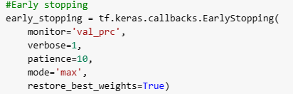
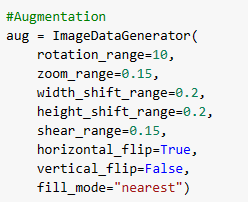
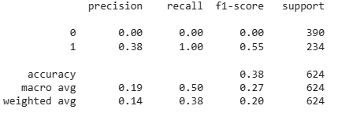

**PNEUMONIA**

**IMAGE CLASSIFICATION** 

**with neural network**

Domenico Armillotta 

[**INTRODUCTION](#_urdhssq3jlsd)	**3****

[**DATASET](#_wanrbli8swde)	**4****

[**DATA PREPARATION](#_bznaczuzbe8m)	**5****

[**CNN FROM SCRATCH](#_84pmf14gbgp1)	**6****

[PRECAUTION USED :](#_e4f287tr67xb)	6

[ALEXNET MODEL LIKE :](#_gztjgnyx9nzw)	7

[MNIST MODEL LIKE](#_agv004z0voa1)	8

[**PRE TRAINED CNN - EFFICENTNET](#_hshp7pcyfprz)	**10****

[**FINAL CONSIDERATION](#_rqg8h5z3577h)	**11****

# **INTRODUCTION**

The goal is to create an application that classifies radiologies in order to understand whether the patient has pneumonia.

The limits will be those offered by Google colab, i.e. 16gb Ram and limited TPU time, if the results are interesting we will go deeper, creating a professional application, with GUI.

All techniques will be used to try to minimise problems such as overfitting.

# **DATASET**
Taken from kaggle : 

[Chest X-Ray Images (Pneumonia) | Kaggle](https://www.kaggle.com/datasets/paultimothymooney/chest-xray-pneumonia)

Divided into directories according to class :

- Train - Test - Validation

each folder contains : 

- Pneumonia - Normal

The training set resulted unbalanced : 

Example of data : 

# **DATA PREPARATION**
A reshape of the images to 180x180 was done, so that they would fit into Google colab's Ram memory.

Three RGB channels were used, so that the classifier could extrapolate more data.

The data i.e. the images and labels were converted into numpy arrays, so as to give them to the network.

The labels are in one-hot format.

# **CNN FROM SCRATCH**

Having analysed the dataset, we realised that we have very few images, so there is a very high risk of overfitting our networks, so we try to use all possible precautions to avoid this.

## **PRECAUTION USED :** 
- multiple **Dropout layers** were used in order to decrease overfitting 
- **Batch normalisation layer** was used in order to decrease overfitting and velocity the training 
- An attempt was made to reduce the number of parameters that could be driven as far as possible, so as not to overfit the model.
- **early stopping** was used to decrease the risk of overfitting
- **class\_weight** was created to manage the unbalanced training set

## **ALEXNET MODEL LIKE :** 
Again, the network overfitted, so the model is unusable for real, robust applications , even if we obtain an accuracy = 85%

Many tests were carried out by changing parameters and values and layers, with little improvement.

This could be caused by the very small training set.

Model used : 

Code : 

## **MNIST MODEL LIKE**
As in alexnet, we have a similar situation here.

Model used : 

Code : 

# **PRE TRAINED CNN - EFFICENTNET**
The feature reuse technique was used, i.e. freezing all layers of the efincent net, and attaching a classifier at the end. 

The network failed to perform well in terms of accuracy, which was around 37%.

All the precautions mentioned above were used.

20/20 [==============================] - 4s 49ms/step

Test Data accuracy:  37.5

# **FINAL CONSIDERATION**
Since the objective was to create a functioning classifier, the intermediate results were not sufficient to continue the test.

The next steps were to be :

\1. explainability of the network

\2. examble method on cnn

\3. Creation of the application with the GUI

The main cause was overfitting, caused by too small a number of samples, and therefore unusable.

Even the performance of similar projects did not post too much better results, projects on the same dataset from kaggle code and the official keras site were compared.

